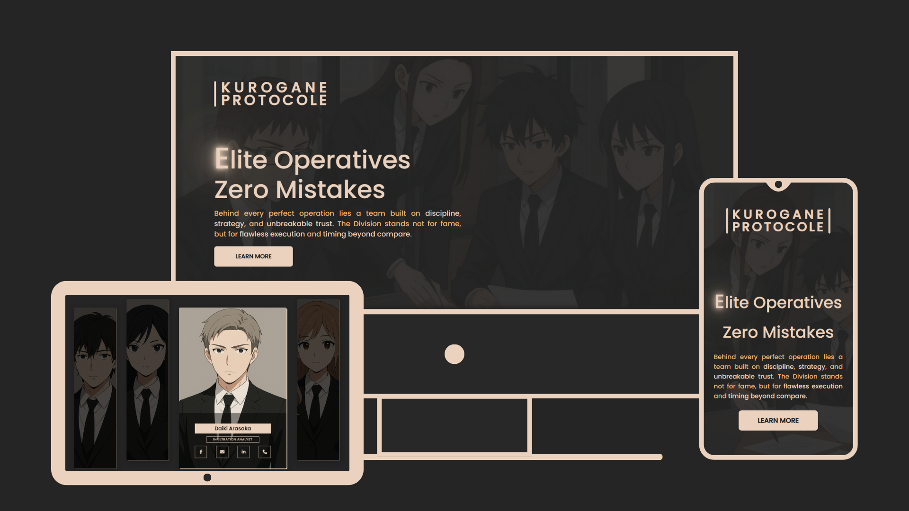

#  Kurogane Protocol

A sleek and modern landing page showcasing elite operatives, operations strategy, and precision execution — built with a focus on UI/UX, responsiveness, and style.

## 🌟 Features

- 🏠 **Home Section:**  
  - Engaging intro with animated text and layered backgrounds  
  - Highlights discipline, strategy, and flawless execution  

- 🎯 **Operations Command:**  
  - Features cards for Precision, Strategy, and Efficiency  
  - Each card has descriptive text and modern icons  

- 👥 **Team Members:**  
  - Displays elite operatives with roles and social links  
  - Clean card design with hover effects  

- 📱 **Responsive Design:**  
  - Optimized for desktop, tablet, and mobile  
  - Mobile-first layout  

- 📬 **Footer & Contact:**  
  - Newsletter subscription  
  - Contact info, location, and company tagline  

## 🧰 Tech Stack

- HTML  
- CSS  
- Font Awesome Icons  
- Vanilla JavaScript  

## 🚀 Live Demo

Try it here 👇  
https://zeddy-forreal.github.io/Kurogane-Protocol

## 📸 Preview



## 📁 How to Run Locally

```bash
git clone https://github.com/Zeddy-Forreal/Kurogane-Protocol.git
cd Kurogane-Protocol
# Then open index.html in your browser

